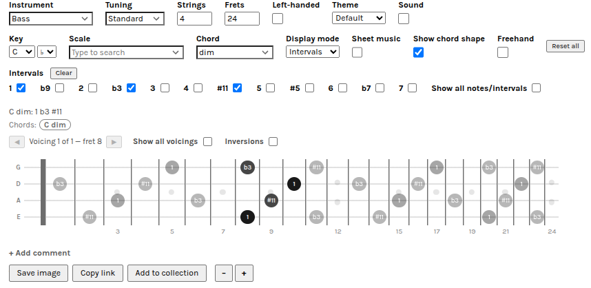

## Holyfret

Holyfret shows scales, chords and intervals across the fretboard of many string
instruments in your browser, at [holyfret.com](https://holyfret.com).

Holyfret might be a weird name...  initially I used to call this app "get-a-grip" which I thought was funny, but 1. the domain weren't available and 2. someone told me it sounded more like a self-help website.. holyfret came in on second place so there you have it.

## Why

Does the world really need another fret visualizing tool? Well, probably not. But this one does exactly what I want for myself i.e. 

- Focus on intervals
- Easy to share a custom chord, arpeggio or scale by simply copying the url
- Support for different string instruments, tunings and also things like left-handed players
- Hopefully simple UI without sacrificing power
- Ability to save one or multiple fretboards, useful for teaching and/or printouts
- No sign-up, free of cookies, just do the thing

I did the first version of this in python many years ago, then mainly focusing on intervals as I personally find that to be important to practice learning. Now it has grown quite large, and with a little time on my hands and the help of coding agents I could scale it up quite quickly to include more functionality.

## Development

Any contribution to the project is warmly welcome, requests, feedback, bugs?

## Screenshots

### License

MIT — see [LICENSE](LICENSE). Bundled third-party assets under `src/vendor/` keep their
own licenses (see `src/vendor/LICENSES.md`).
